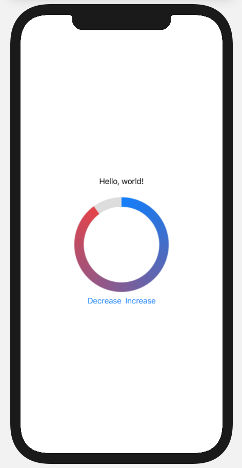

# Circular Indicator SwiftUI

Simple SwiftUI view. Circular indicator with gradient color.
You can set lineWidth and amount 0...100.
Add buttons and @State var to control the amount.

### Usage:
* `SwiftUI`
* `Shape`

